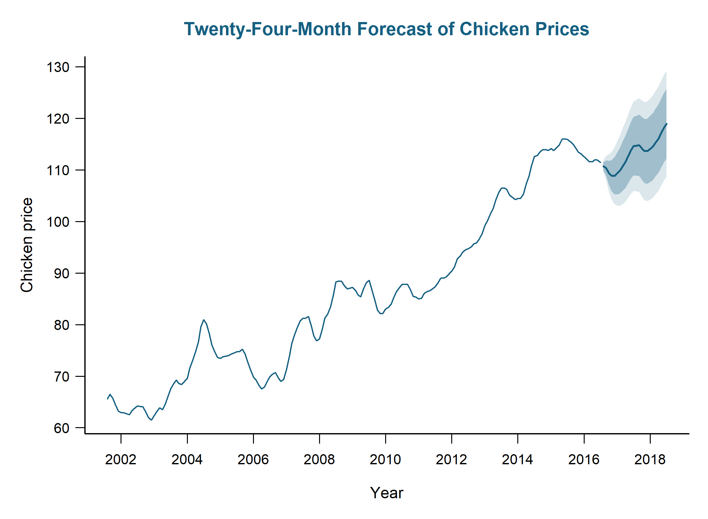

# Georgia Dock Chicken Price Forecasting

An end-to-end time-series analysis of monthly whole-bird spot prices at Georgia docks, from data discovery and model identification through rolling-origin validation and a 24-month forecast.



## Business Problem and Objectives

A procurement or financial-planning stakeholder needs a defensible estimate of future chicken prices to support budgeting, purchasing, and risk planning. The decision is not limited to identifying a single expected price; it also requires an estimate of the uncertainty surrounding that price over a two-year planning horizon.

| Item | Project definition |
| --- | --- |
| Stakeholder | Procurement and financial-planning teams exposed to changes in wholesale chicken prices |
| Business question | How can historical Georgia dock chicken prices support two-year budgeting and procurement planning? |
| Decision | Establish a baseline price outlook and planning range for August 2016 through July 2018 |
| Problem | Model the trend and recurring dependence in a monthly price series without overstating forecast certainty |
| Constraints | A univariate series of 180 historical observations, no external predictors, and increasing uncertainty across a 24-month horizon |
| Success criteria | Select a diagnostically adequate model through out-of-sample validation, outperform relevant benchmarks, quantify forecast uncertainty, and make the analysis reproducible in R |

## Data and Discovery

The analysis uses the `chicken` dataset distributed with the `astsa` R package. The repository contains a clean extract in [`data/chicken_prices.csv`](data/chicken_prices.csv).

| Data characteristic | Detail |
| --- | --- |
| Measure | Monthly whole-bird spot price at Georgia docks |
| Period | August 2001-July 2016 |
| Observations | 180 consecutive months |
| Unit | U.S. cents per pound |
| Quality checks | Expected schema, no missing values, correct observation count, and consecutive monthly dates |

Exploratory analysis produced four findings relevant to the modeling strategy:

- Prices increased from approximately 66 cents per pound in 2001 to more than 110 cents per pound in 2016 while retaining relatively stable variance. The original scale was therefore retained.
- The original-series ACF decayed slowly, and the augmented Dickey-Fuller test did not reject a unit root (`p = .885`).
- Both the ordinary difference and the lag-12 difference rejected the unit-root null at the reported lower bound of `.01`. Neither differencing path was treated as predetermined.
- The ordinary-difference ACF/PACF suggested a short nonseasonal autoregressive structure with recurring annual dependence, while the seasonal-difference path supported a separate family of plausible candidates.

The analysis assumes that the historical dependence in the series remains informative across the forecast horizon. It does not assume that the model can anticipate structural breaks, supply disruptions, policy changes, or other external shocks that are absent from the data.

## Solution Design

The solution uses a theory-driven SARIMA screening process followed by expanding-window validation. This design separates model identification from model selection and prevents a favorable in-sample statistic from determining the forecast model on its own.

1. Inspect the original series for trend, seasonality, outliers, and changing variance.
2. Compare ordinary and lag-12 seasonal differences using time plots, ACF/PACF behavior, and augmented Dickey-Fuller tests.
3. Screen eight ACF/PACF-justified SARIMA specifications across the `d=1, D=0` and `d=0, D=1` families.
4. Retain only candidates with significant structural coefficients, stationary and invertible roots, and Ljung-Box p-values above `.05` at lags 12, 24, and 36.
5. Test drift only as a nested addition to retained ordinary-difference models. Drift was not significant and was omitted.
6. Compare eligible candidates against seasonal-naive and random-walk-with-drift benchmarks through expanding-window forecasts.
7. Select the diagnostically adequate candidate with the lowest aggregate validation RMSE, using MAE, parsimony, and within-family AICc as supporting criteria.
8. Refit the selected model to all 180 observations and generate a 24-month forecast with 80% and 95% prediction intervals.

The screening stage was intentionally broader than the final comparison. A brute-force high-order model was not included because its complexity was not supported by the identification patterns. The final comparison contains only candidates that met the predefined eligibility conditions rather than an arbitrary number of models.

## Development

The project is implemented entirely in R. [`analysis/chicken_sales_forecast.R`](analysis/chicken_sales_forecast.R) is the single reproducible entry point for data checks, exploratory analysis, model screening, validation, selection, diagnostics, and forecasting.

The script uses base R with the `forecast` and `fUnitRoots` packages. It reads the clean CSV and recreates the seven figures and consolidated result files. A database and application layer were not required because the project uses one small, versioned analytical dataset and produces static portfolio artifacts rather than a deployed forecasting service.

```text
.
|-- analysis/   # Portable R analysis, screening, validation, and forecast pipeline
|-- data/       # Clean monthly price series used by the script
|-- figures/    # Exploratory, diagnostic, and forecast graphics
|-- report/     # Full written analysis
|-- results/    # Screening, validation, estimates, tests, and forecasts
`-- README.md   # Portfolio summary
```

To reproduce the analysis, install the required packages:

```r
install.packages(c("forecast", "fUnitRoots"))
```

Then run the following command from the repository root:

```bash
Rscript analysis/chicken_sales_forecast.R
```

## Testing and Validation

The pipeline asserts that the input contains 180 consecutive monthly observations with the expected fields and no missing values. Retained SARIMA candidates must have significant structural coefficients, stationary and invertible fitted roots, and Ljung-Box p-values above `.05` at lags 12, 24, and 36. Drift variants are evaluated as nested significance checks rather than assumed additions.

Forecast performance is evaluated through an expanding window with an initial 120-month training period, 37 forecast origins, and horizons from 1 through 24 months. RMSE and MAE are reported at horizons 1, 12, and 24 and across all available forecast errors.

Eight theory-driven SARIMA candidates were screened. The lower-order ordinary-difference AR(1) model and all three seasonal-difference models retained residual dependence. Adding AR(3) or MA(1) to the ordinary-difference AR(2) structure produced nonsignificant coefficients without a diagnostic advantage. The following two models were the only eligible finalists:

| Eligible candidate | Aggregate RMSE | Aggregate MAE | Diagnostic result |
| --- | ---: | ---: | --- |
| SARIMA(2,1,0) x (1,0,1)[12] | 5.604 | 4.528 | Passed coefficient, root, and residual checks |
| SARIMA(2,1,0) x (1,0,0)[12] | 6.576 | 5.307 | Passed coefficient, root, and residual checks |

The selected model also outperformed the random-walk-with-drift benchmark (`RMSE = 5.898`) and the seasonal-naive benchmark (`RMSE = 11.509`). This combination of diagnostic adequacy and rolling-origin performance supports the selection more strongly than information criteria alone.

## Results and Decision Support

SARIMA(2,1,0) x (1,0,1)[12] without drift provided the best validated forecast performance among the eligible candidates. Its aggregate RMSE was 14.8% lower than the eligible runner-up and 5.0% lower than the random-walk-with-drift benchmark.

| Result | Value |
| --- | --- |
| Selected model | SARIMA(2,1,0) x (1,0,1)[12], without drift |
| Validation design | Expanding window, 37 origins, 24-month horizon |
| Aggregate RMSE | 5.604 cents per pound |
| Aggregate MAE | 4.528 cents per pound |
| Forecast horizon | August 2016-July 2018 |
| First point forecast | 110.8 cents per pound |
| Final point forecast | 114.9 cents per pound |
| Final 95% prediction interval | 97.7-132.0 cents per pound |

The forecast provides a baseline price path and a range that can support budget scenarios, procurement timing discussions, and risk tolerances. The point forecast reaches a short-term low of 108.9 cents per pound in December 2016 and then rises with recurring fluctuations to 114.9 cents per pound by July 2018.

The selected model has a seasonal AR estimate of 0.979 and a minimum AR root of 1.002. Although the fitted root remains outside the unit circle, its proximity to the boundary makes the seasonal behavior highly persistent and somewhat sensitive to small changes in the data or model specification. The widening long-horizon prediction intervals reinforce that these forecasts should be used as planning ranges rather than precise predictions of future market conditions.

This is a historical forecasting case study rather than a production service. A production implementation would require refreshed price data, scheduled model re-estimation, monitoring of forecast errors and residual autocorrelation, and alerts for structural changes. Useful next steps include evaluating external predictors such as feed costs, energy prices, supply measures, and major market disruptions; comparing alternative forecasting methods; and recalibrating prediction intervals as new observations become available.

### Key deliverables

- [Full project report](report/chicken_sales_time_series_report.docx)
- [Portable R analysis](analysis/chicken_sales_forecast.R)
- [Candidate screening](results/candidate_screening.csv)
- [Rolling-origin validation](results/rolling_validation.csv)
- [Finalist comparison](results/finalist_comparison.csv)
- [Twenty-four-month forecast](results/forecast_24_months.csv)

### Tools and methods

R; `forecast`; `fUnitRoots`; SARIMA modeling; ACF/PACF analysis; augmented Dickey-Fuller testing; Ljung-Box diagnostics; expanding-window forecast validation; benchmark comparison; prediction intervals.
